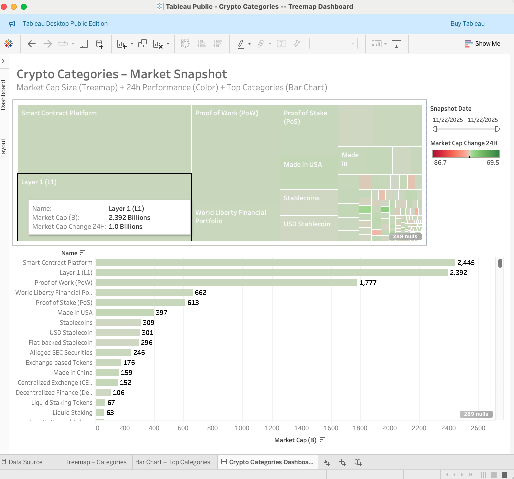

# 📊 Crypto Categories Dashboard

### *Python + CoinGecko API + Tableau Public*



## 🔍 Project Overview

This project uses the **CoinGecko API** to pull real-time cryptocurrency
**category-level** market data and visualize it using **Tableau
Public**.\
It serves as a portfolio-friendly example of:

-   API data ingestion\
-   Data transformation using Python\
-   Visual analytics with Tableau\
-   Dashboard design\
-   GitHub project structure

> **Note:** The API key shown in `fetch_categories.py` is intentionally
> non-functional because it has been deleted. It is exposed only to
> illustrate how the code works.

View the live dashboard here:\
👉
**https://public.tableau.com/app/profile/shlok.keshari/viz/CryptoCategories--TreemapDashboard/CryptoCategoriesDashboard**

------------------------------------------------------------------------

## 🛠 Tech Stack

| Component      | Technology |
|----------------|------------|
| Data Source    | CoinGecko API |
| Backend / ETL  | Python, Pandas |
| Visualization  | Tableau Public |
| Repository     | GitHub |
| File Formats   | CSV, TWBX, PNG |


------------------------------------------------------------------------

## 📁 Project Structure

    crypto-category-dashboard/
    │
    ├── data/
    │   └── crypto_categories_snapshot.csv
    │
    ├── src/
    │   └── fetch_categories.py
    │
    ├── visualization/
    │   ├── Crypto Categories -- Treemap Dashboard.twbx
    │   └── dashboard_preview.png
    │
    ├── .gitignore
    └── README.md

------------------------------------------------------------------------

## 📈 Dashboard Features

### 🔹 Treemap --- Market Cap Size + 24h Change

-   Each rectangle = a crypto category\
-   **Size** = Market Cap (Billions)\
-   **Color** = Market Cap Change (24h)\
-   Green = positive, Red = negative

### 🔹 Bar Chart --- Top Categories by Market Cap

-   Sorted descending by Market Cap\
-   Colored by 24h performance

### 🔹 Snapshot Date Filter

-   Enables interactive switching between different daily snapshots

------------------------------------------------------------------------

## 🚀 How the Data Pipeline Works

1.  A Python script calls the CoinGecko API\

2.  Returns category-level metrics:

    -   Market Cap\
    -   24h Change\
    -   24h Volume\

3.  Data is transformed and saved into:

        data/crypto_categories_snapshot.csv

4.  Tableau reads the CSV to generate visuals

------------------------------------------------------------------------

## 🧪 Running the Pipeline

``` bash
python src/fetch_categories.py
```

This will generate an updated snapshot.

------------------------------------------------------------------------

## 🚀 Future Enhancements

-   Automate daily sync using Google Sheets + Tableau Public refresh\
-   Add Market Cap vs Volume Scatter Plot\
-   Add multi-day trend lines\
-   Build a web-based version

------------------------------------------------------------------------

## 📬 Contact

If you'd like help improving your own dashboards, feel free to reach
out.
